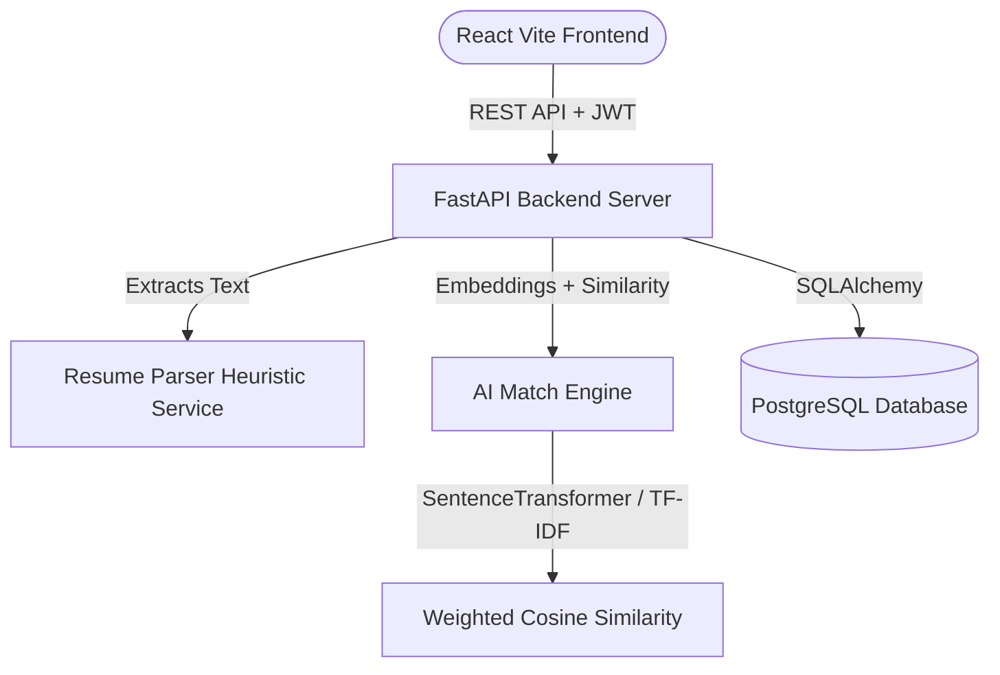
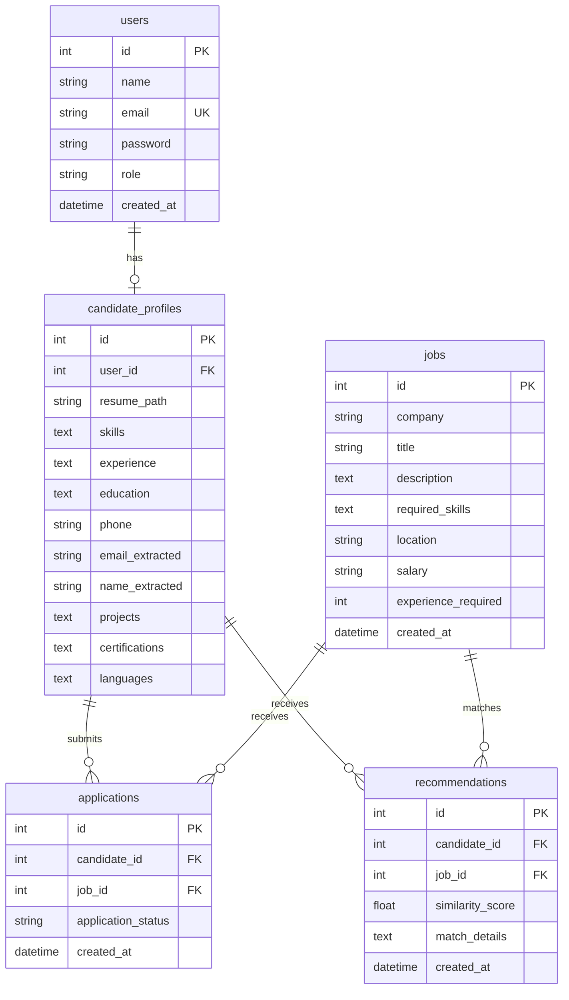
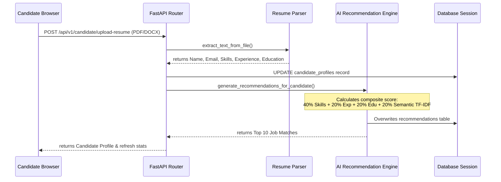

# AI-Powered Job Recommendation System Using Resume Parsing

An enterprise-ready, full-stack AI-Powered Job Recommendation System. Candidates upload resumes (PDF/DOCX), qualifications are parsed and normalized, and matches are calculated using semantic word embeddings and heuristic match rules against active job postings.

---

## 🏗️ Architecture & Flow Diagrams

### System Architecture


### Database ER Diagram


### AI recommendation flow


---

## ⚡ Setup & Run Instructions

### Prerequisites
- Python 3.12+
- Node.js 18+
- PostgreSQL (Optional, fallback defaults to SQLite)

---

### Local Manual Installation

#### 1. Backend API Setup
```bash
# Navigate to backend directory
cd backend

# Create virtual environment
python -m venv venv

# Activate virtual environment
# Windows:
.\venv\Scripts\activate
# Linux/macOS:
source venv/bin/activate

# Install package dependencies
pip install -r requirements.txt

# Run server in reload development mode
uvicorn app.main:app --reload
```
    
The swagger UI docs are now live at `http://localhost:8000/docs`.

#### 2. Frontend SPA Setup
```bash
# Navigate to frontend directory
cd frontend

# Install package dependencies
npm install

# Start Vite live server
npm run dev
```
The React development server is now live at `http://localhost:5173`.

---

### Docker Deployment

To build and compile all containers (Database, API Backend, React Client served via proxy) in a single command, execute from the root directory:

```bash
# Spin up Docker containers
docker-compose up --build
```
- Access Frontend Client: `http://localhost`
- Access Backend API: `http://localhost/api/v1`

---

## 📁 Project Directory Structure
```
job-recommendation-system/
├── backend/
│   ├── app/
│   │   ├── api/             # API Routers (auth, candidate, recruiter, admin)
│   │   ├── core/            # Configuration and JWT settings
│   │   ├── database/        # Database session and base
│   │   ├── models/          # SQLAlchemy Database models
│   │   ├── schemas/         # Pydantic schemas validation
│   │   ├── services/        # Resume Parser & Match Engine services
│   │   └── main.py          # FastAPI application entry point
│   ├── tests/               # Pytest unit and integration test scripts
│   ├── requirements.txt     # Python backend dependencies
│   └── Dockerfile           # Backend deployment script
├── frontend/
│   ├── src/
│   │   ├── components/      # Glassmorphic Layout, Sidebar, Navbar
│   │   ├── context/         # AuthContext JWT session bindings
│   │   ├── pages/           # Landing, Login, Register, Profile, Dashboards
│   │   ├── services/        # Axios API client setup with Auto-Token Refresh
│   │   ├── types/           # TypeScript interfaces
│   │   ├── App.tsx          # Router setup and role routes guards
│   │   ├── index.css        # Tailwind directives and scrollbar styles
│   │   └── main.tsx         # Mount node
│   ├── package.json         # Node packages
│   ├── tailwind.config.js   # Tailwind custom theme definitions
│   ├── vite.config.ts       # Proxy mappings
│   ├── nginx.conf           # Reverse proxy routing rules
│   └── Dockerfile           # Frontend compilation script
├── docker-compose.yml       # Docker orchestrator
├── .env.example             # Env variables template
└── README.md                # System documentation
```

---

## 🧪 Running Automated Tests

To execute unit and route integration tests, run from the `backend/` directory:

```bash
# Execute Pytest suite
pytest -v
```

---

## 📊 Sample Data

A set of initial users can be registered directly from the frontend UI interface:
1. **Candidate User**: Role `candidate` (Upload resume, review semantic match recommendations).
2. **Recruiter User**: Role `recruiter` (Create job postings, inspect candidate resumes and change application workflow status).
3. **Admin User**: Role `admin` (Verify registered accounts audit and view dashboard analytics charts).
=======
# Job-Recommendation
8f3a48150c52af79da064b69293c922d9ed5ce24
